# Задача 1

## Скачиваем образ nginx:1.29.0
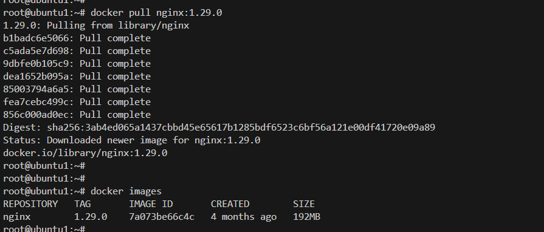

## Создаем Dockerfile, собираем образ
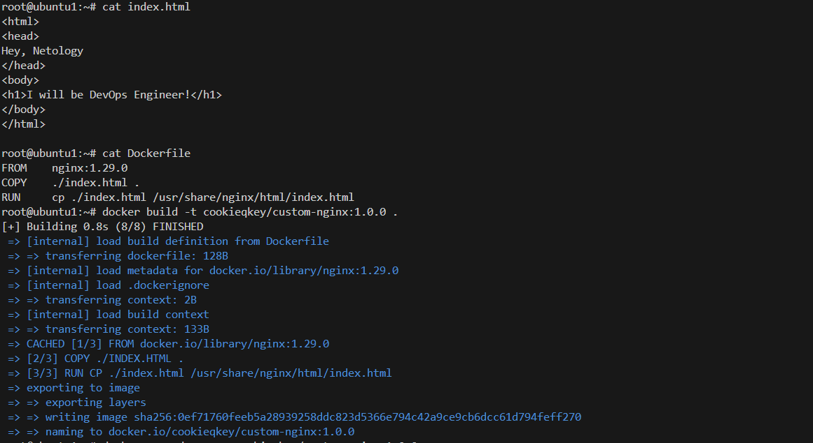

## Загружаем образ
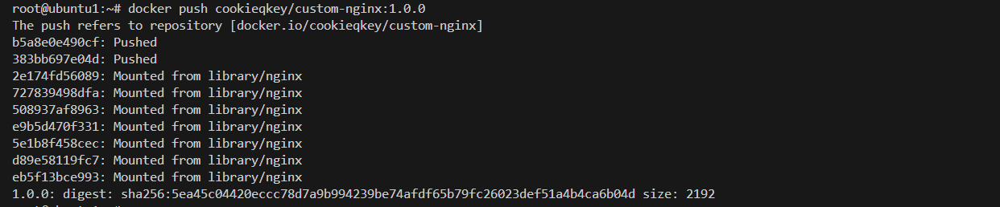

**Ссылка:**
```docker pull cookieqkey/custom-nginx:1.0.0```

# Задача 2

## Запущенный образ и вывод команд
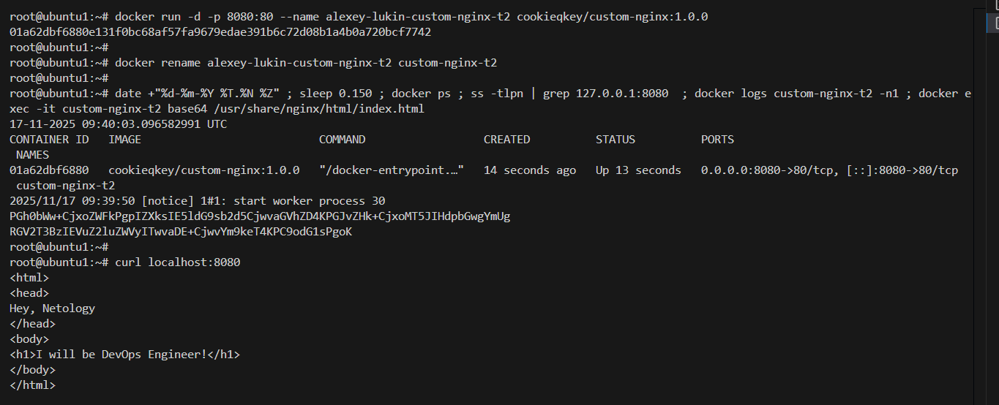

# Задача 3

## Стандартный поток вывода логов
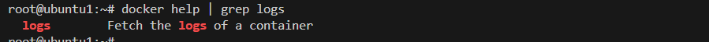

## Подключаемся, выполняем Ctrl+C, и проверяем статус контейнера
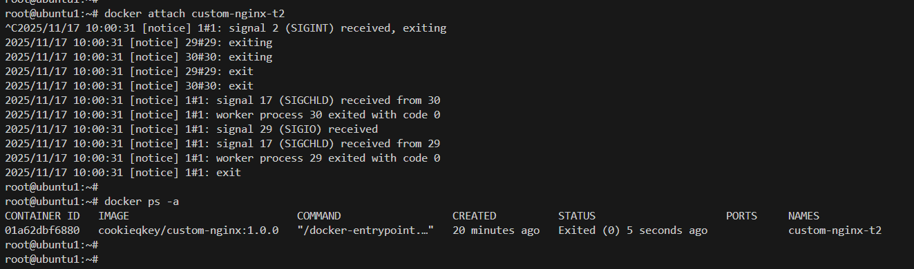
, который перешел в "Exited", т.к. был передан сигнал SIGINT(завершение работы процесса)

## Заходим в контейнер и выполняем update для установки теустового редактора
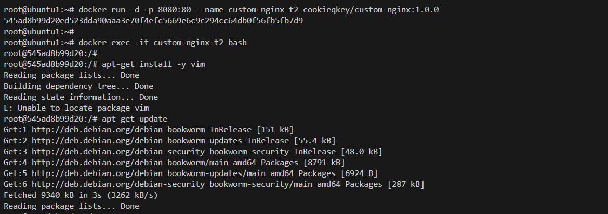

## Устанавливаем текстовый редактор
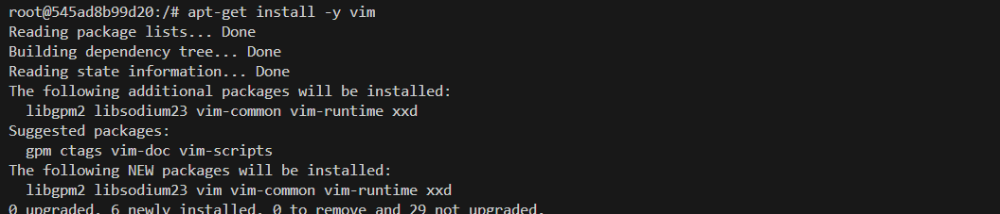

## Текстовый редактор установлен
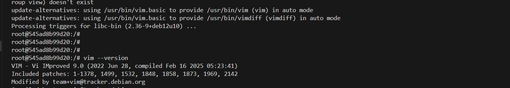

## Меняем порт на 81 в конф. файле Nginx
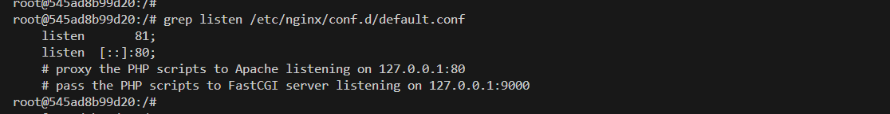

## Перечитываем и выполняем curl


## Выполняем запрос на localhost:8080
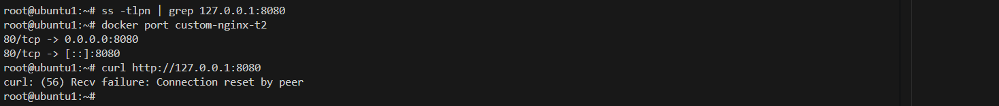
, получаем ошибку, т.к. порт 8080 хост системы сопоставлен с портом 80 в контейнере, который больше не слушается

## *Меняем порт в контйнере "на лету"
**Останавливаем контейнер и сервис docker**
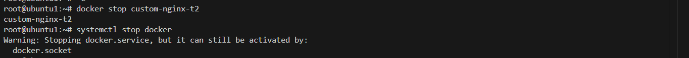

**Получаем ID контейнера**
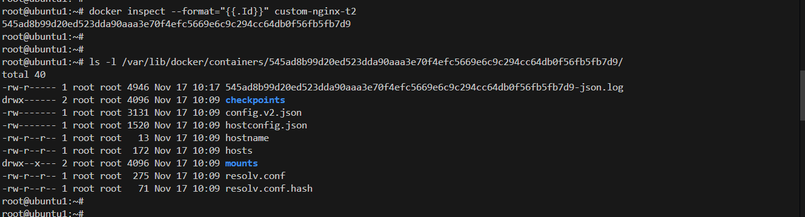

**Ищем параметр с описанием сопоставления портов**
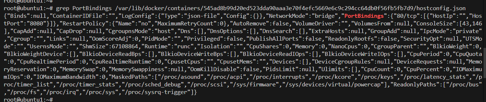

**Меняем порт на 81**
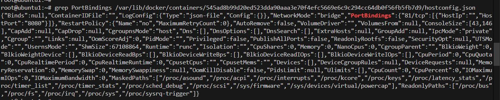

**Ищем параметр с перечислением доступных для потенциальных соединений портов внутри контейнера**
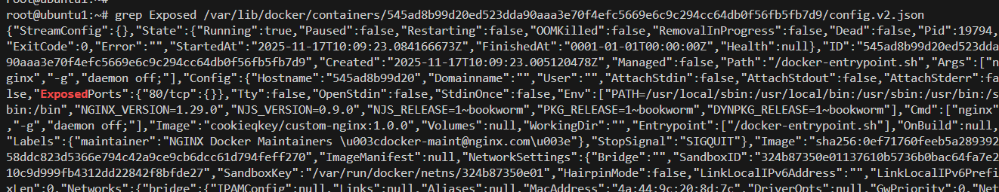

**Добавляем новый порт 81**
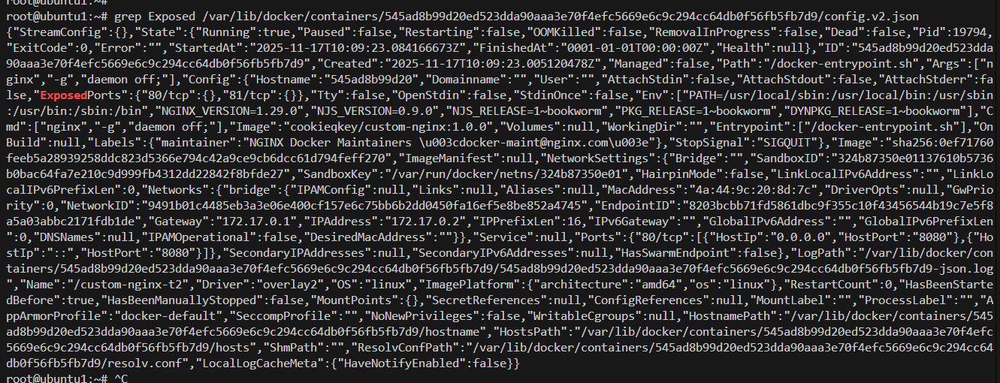

**Запускаем сервис и контейнер, повторяем запрос на 8080**
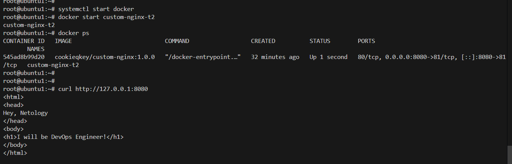

**Удаляем контейнер**
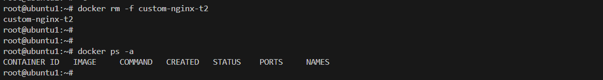

# Задача 4

## Запустите первый контейнер из образа centos c любым тегом в фоновом режиме, подключив папку текущий рабочий каталог $(pwd) на хостовой машине в /data контейнера, используя ключ -v.
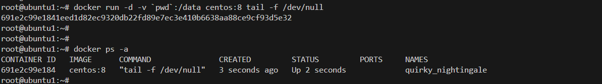

## Запустите второй контейнер из образа debian в фоновом режиме, подключив текущий рабочий каталог $(pwd) в /data контейнера.
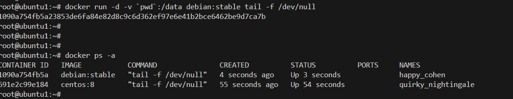

## Подключитесь к первому контейнеру с помощью docker exec и создайте текстовый файл любого содержания в /data.
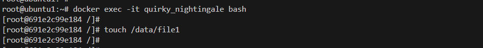

## Добавьте ещё один файл в текущий каталог $(pwd) на хостовой машине.
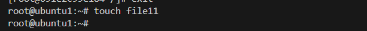

## Подключитесь во второй контейнер и отобразите листинг и содержание файлов в /data контейнера.
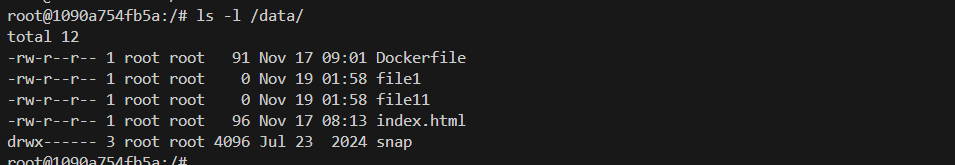

# Задача 5

## 1. Создайте отдельную директорию(например /tmp/netology/docker/task5) и 2 файла внутри него

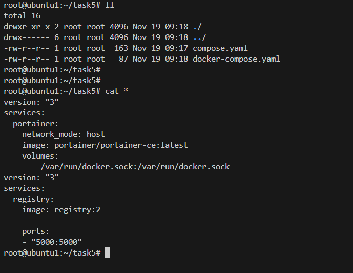

**выполните "docker compose up -d"**

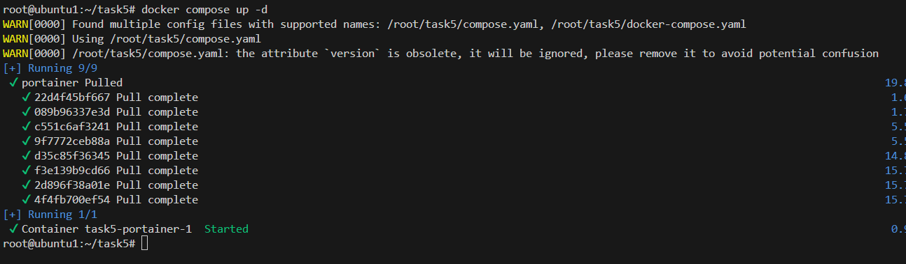

**Какой из файлов был запущен и почему?**

был запущен compose.yaml, потому что:

> The default path for a Compose file is compose.yaml (preferred) or compose.yml that is placed in the working directory. Compose also supports docker-compose.yaml and docker-compose.yml for backwards compatibility of earlier versions. If both files exist, Compose prefers the canonical compose.yaml.

## 2. Отредактируйте файл compose.yaml так, чтобы были запущенны оба файла.

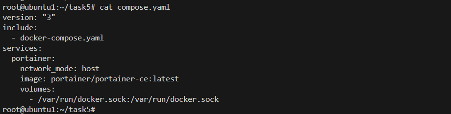

## 3. Выполните в консоли вашей хостовой ОС необходимые команды чтобы залить образ custom-nginx как custom-nginx:latest в запущенное вами, локальное registry

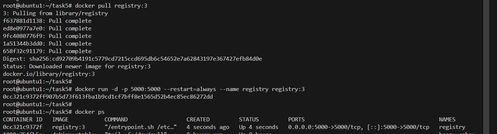

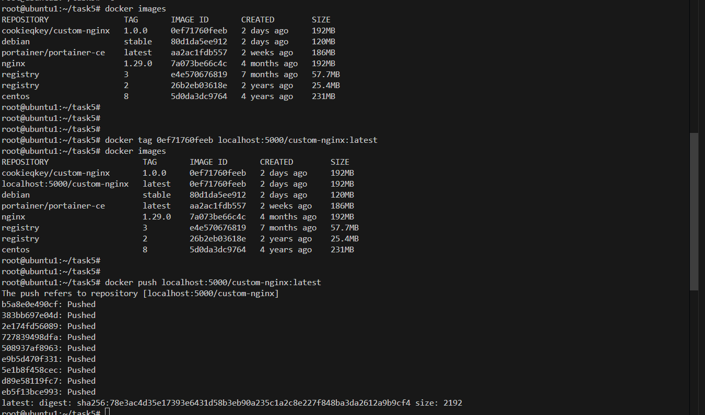

## 4. Откройте страницу "https://127.0.0.1:9000" и произведите начальную настройку portainer.

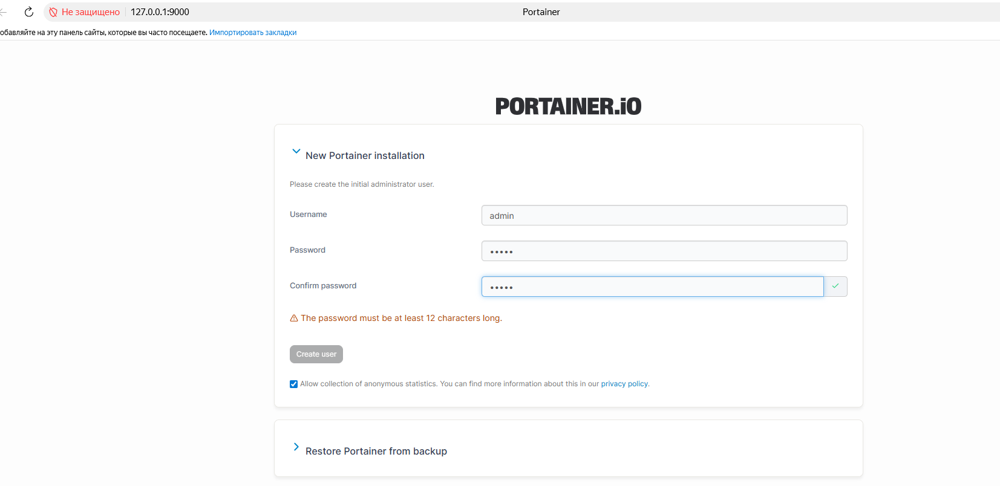

## 5. Откройте страницу "http://127.0.0.1:9000/#!/home", выберите ваше local окружение. Перейдите на вкладку "stacks" и в "web editor" задеплойте следующий компоуз


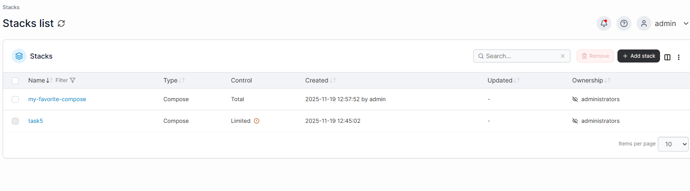

## 6. Перейдите на страницу "http://127.0.0.1:9000/#!/2/docker/containers", выберите контейнер с nginx и нажмите на кнопку "inspect". В представлении <> Tree разверните поле "Config" и сделайте скриншот от поля "AppArmorProfile" до "Driver".

```AppArmorProfile:"docker-default",
Args:[
"nginx",
"-g",
"daemon off;"
],
Config:{
AttachStderr:true,
AttachStdin:false,
AttachStdout:true,
Cmd:[
"nginx",
"-g",
"daemon off;"
],
Domainname:"",
Entrypoint:[
"/docker-entrypoint.sh"
],
Env:[
"PATH=/usr/local/sbin:/usr/local/bin:/usr/sbin:/usr/bin:/sbin:/bin",
"NGINX_VERSION=1.29.0",
"NJS_VERSION=0.9.0",
"NJS_RELEASE=1~bookworm",
"PKG_RELEASE=1~bookworm",
"DYNPKG_RELEASE=1~bookworm"
],
ExposedPorts:{
80/tcp:{
}
},
Hostname:"6f196756784f",
Image:"127.0.0.1:5000/custom-nginx",
Labels:{
com.docker.compose.config-hash:"8b9fe9ab3a7934244a4cb3d97ea83abe99d1849b88a7d7931370a021dd008c42",
com.docker.compose.container-number:"1",
com.docker.compose.depends_on:"",
com.docker.compose.image:"sha256:0ef71760feeb5a28939258ddc823d5366e794c42a9ce9cb6dcc61d794feff270",
com.docker.compose.oneoff:"False",
com.docker.compose.project:"my-favorite-compose",
com.docker.compose.project.config_files:"/data/compose/1/docker-compose.yml",
com.docker.compose.project.working_dir:"/data/compose/1",
com.docker.compose.service:"nginx",
com.docker.compose.version:"",
maintainer:"NGINX Docker Maintainers <docker-maint@nginx.com>"
},
OnBuild:null,
OpenStdin:false,
StdinOnce:false,
StopSignal:"SIGQUIT",
Tty:false,
User:"",
Volumes:null,
WorkingDir:""
},
Created:"2025-11-19T09:57:53.102081912Z",
```

## 7. Удалите любой из манифестов компоуза(например compose.yaml). Выполните команду "docker compose up -d". Прочитайте warning, объясните суть предупреждения и выполните предложенное действие. Погасите compose-проект ОДНОЙ(обязательно!!) командой.

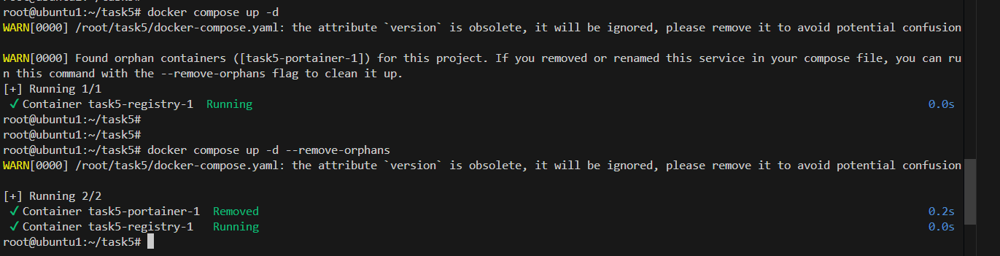

Суть сообщения:

> WARN[0000] Found orphan containers ([task5-portainer-1]) for this project. If you removed or renamed this service in your compose file, you can run this command with the --remove-orphans flag to clean it up.

заключается в том, что найдены запущенные контейнеры сироты для запускаемого проекта(compose-файла), и после того, как мы удалили один из манифестов, их необходимо убить для запуска обновленного проекта

