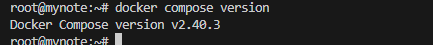
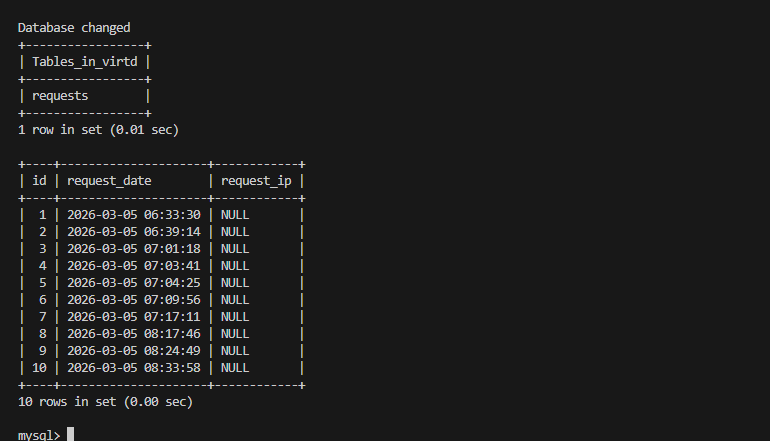
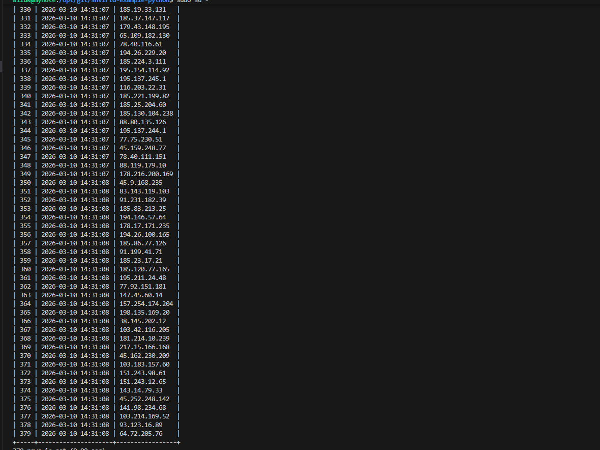
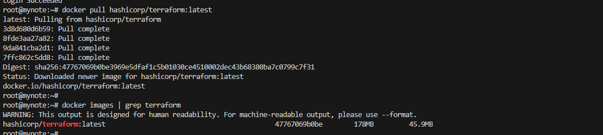
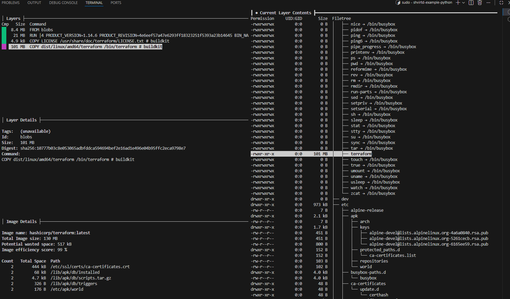

# Задача 0

## Убедитесь что у вас УСТАНОВЛЕН docker compose(без тире) версии не менее v2.24.X, для это выполните команду docker compose version
()

# Задача 2

## В качестве ответа приложите отчет сканирования.
[vulnerabilities.csv](vulnerabilities.csv)

# Задача 3

## Остановите проект. В качестве ответа приложите скриншот sql-запроса.


# Задача 4

## Повторите SQL-запрос на сервере и приложите скриншот и ссылку на fork.
[shvirtd-example-python-fork](https://github.com/cookieqkey/shvirtd-example-python)



# Задача 6

## Скачайте docker образ hashicorp/terraform:latest и скопируйте бинарный файл /bin/terraform на свою локальную машину, используя dive и docker save. Предоставьте скриншоты действий .

* ###  Загрузка



* ### Сохранение

1. #### Выгрузить образ в архив

```
root@mynote:~# docker save hashicorp/terraform:latest -o terraform_tmp.tar
root@mynote:~# 
root@mynote:~# 
root@mynote:~# tar -xf terraform_tmp.tar -C terraform_tmp
root@mynote:~# 
root@mynote:~# 
root@mynote:~# ls -l terraform_tmp
total 16
drwxr-xr-x 3 root root 4096 Jan  1  1970 blobs
-rw-r--r-- 1 root root  450 Jan  1  1970 index.json
-rw-r--r-- 1 root root  465 Jan  1  1970 manifest.json
-r--r--r-- 1 root root   30 Jan  1  1970 oci-layout
```

2. #### Найти digest слоя с помощью ```dive hashicorp/terraform:latest```



3. #### По digest найти конфиг образа и в manifest.json найти идентификаторы слоев, взять нужный(последний)
```
root@mynote:~# grep -Rl 10777b03c8e053065adbfddca594694bef2e16ad1e496e04b95ffc2eca9798e7 terraform_tmp
terraform_tmp/blobs/sha256/5c2e634c18e3be39f26ca9d068687adaeb9ac44f4dca9a4a4b8f69ae40433dfb
root@mynote:~# 
root@mynote:~# 
root@mynote:~# cat terraform_tmp/manifest.json | jq
[
  {
    "Config": "blobs/sha256/5c2e634c18e3be39f26ca9d068687adaeb9ac44f4dca9a4a4b8f69ae40433dfb",
    "RepoTags": [
      "hashicorp/terraform:latest"
    ],
    "Layers": [
      "blobs/sha256/9da841cba2d188205a2fa437c08e0f3819d6de84dae71e78e70515e282f44e6e",
      "blobs/sha256/8fde3aa27a82bfa8554d2c5a6f347a8368a9ca09048f87dc67a2cabf8e405bf8",
      "blobs/sha256/7ffc862c5dd8980a7a840dde2d756e701f7d0c47d8fc8405e71ef3d4dd70f2b9",
      "blobs/sha256/3d8d680d6b59a501b0514357cdb6d393b2cbe92c06d7d2e0ff09d88acc587820"
    ]
  }
]
```
5. #### Выгрузить из образа файл
```
root@mynote:~# tar -xf terraform_tmp/blobs/sha256/3d8d680d6b59a501b0514357cdb6d393b2cbe92c06d7d2e0ff09d88acc587820 bin/terraform
root@mynote:~# ls -l bin/terraform
-rwxr-xr-x 1 root root 100593848 Feb 25 15:57 bin/terraform
```

# Задача 6.1

### Добейтесь аналогичного результата, используя docker cp. Предоставьте скриншоты действий .

```
root@mynote:~# docker create --name terraform_tmp hashicorp/terraform:latest
4c9fd8315b6a9bf6921843bffa40386839dce9a9896f878a6d65039d33c6e748
root@mynote:~# 
root@mynote:~# docker cp terraform_tmp:/bin/terraform .
Successfully copied 101MB to /root/.
root@mynote:~# ls -l terraform
-rwxr-xr-x 1 root root 100593848 Feb 25 15:57 terraform
```