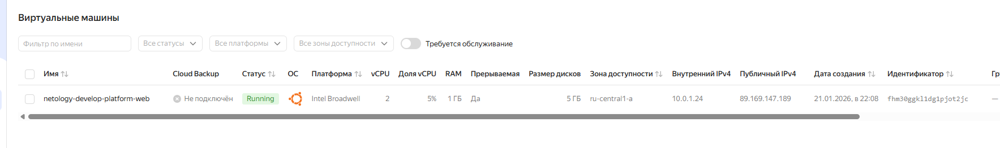
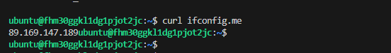

# Задача 1
*- Инициализируйте проект, выполните код. Исправьте намеренно допущенные синтаксические ошибки. Ищите внимательно, посимвольно. Ответьте, в чём заключается их суть.*

Возникает ошибка:
```
│ Error: Error while requesting API to create instance: client-request-id = 82b24948-8fec-4068-bd67-b0f0ed2c1f93 client-trace-id = 722ee33c-af3a-4ac4-b045-c5e88de2d4c3 rpc error: code = FailedPrecondition desc = Platform "standart-v4" not found
│ 
│   with yandex_compute_instance.platform,
│   on main.tf line 15, in resource "yandex_compute_instance" "platform":
│   15: resource "yandex_compute_instance" "platform" {
│ 
```
, т.к. standart-v4 - не существует, существует standard-v4a, но выбран будет standard-1 c cores = 2 ;

*- Скриншот ЛК Yandex Cloud с созданной ВМ, где видно внешний ip-адрес;*



*- Скриншот консоли, curl должен отобразить тот же внешний ip-адрес;*



*- Ответьте, как в процессе обучения могут пригодиться параметры preemptible = true и core_fraction=5 в параметрах ВМ.*

preemptible = true - прерываемая ВМ, позволит случайно не потратить все деньги, если забыть удалить самостоятельно;
core_fraction = 5 - ограничивает долю процессорного времени выделяемого на ядро до 5%, также позволяет сэкономить