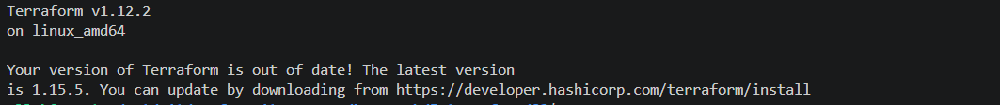
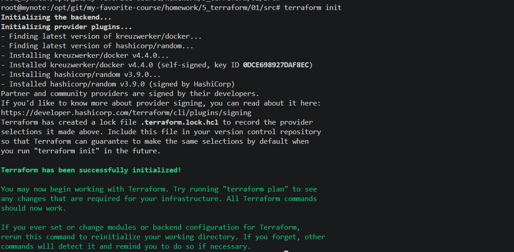
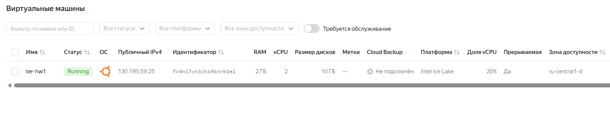

# Задача 1

*Скачайте и установите Terraform версии >=1.12.0 . Приложите скриншот вывода команды terraform --version.*



*Перейдите в каталог src. Скачайте все необходимые зависимости, использованные в проекте.*



*Изучите файл .gitignore. В каком terraform-файле, согласно этому .gitignore, допустимо сохранить личную, секретную информацию?(логины,пароли,ключи,токены итд)*

В файле `personal.auto.tfvars`

*Раскомментируйте блок кода, примерно расположенный на строчках 29–42 файла main.tf. Выполните команду terraform validate. Объясните, в чём заключаются намеренно допущенные ошибки. Исправьте их.*

- `Error: Missing name for resource`: ресурсы должны иметь 2 label `type` и `name`:

```
resource "docker_image" "nginx" {
  name         = "nginx:latest"
  keep_locally = true
}
```

- `Error: Invalid resource name`: некорректное имя `1nginx`, исправлено на `nginx`;

- `Error: Reference to undeclared resource`: `random_string_FAKE` не указан в root-модуле, исправлено на `random_string`;

- `Error: Unsupported attribute`: аттрибут `resulT` не существует, исправлен на `result`;


*Выполните код. В качестве ответа приложите: исправленный фрагмент кода и вывод команды docker ps.*

```
# docker ps
CONTAINER ID   IMAGE          COMMAND                  CREATED         STATUS         PORTS                  NAMES
6e4bee97b481   0236ee02dcbc   "/docker-entrypoint.…"   7 seconds ago   Up 6 seconds   0.0.0.0:9090->80/tcp   example_eT1GT4LiWmjdNCCH
```

*Замените имя docker-контейнера в блоке кода на hello_world. Не перепутайте имя контейнера и имя образа. Мы всё ещё продолжаем использовать name = "nginx:latest". Выполните команду terraform apply -auto-approve. Объясните своими словами, в чём может быть опасность применения ключа -auto-approve. Догадайтесь или нагуглите зачем может пригодиться данный ключ? В качестве ответа дополнительно приложите вывод команды docker ps.*

- `-auto-approve` выполняет изменения без запроса подтверждения, и если окажется, что была допущена ошибка, то возможности остановиться не будет;
- `-auto-approve` помогает когда нужно отключить подтверждение при автоматической раскатке гарантированно корректного скрипта, когда нажать `yes` будет некому;
- вывод команды: 
```
# docker ps
CONTAINER ID   IMAGE          COMMAND                  CREATED         STATUS         PORTS                  NAMES
0784fa9a5d53   0236ee02dcbc   "/docker-entrypoint.…"   9 seconds ago   Up 8 seconds   0.0.0.0:9090->80/tcp   hello_world
```

*Уничтожьте созданные ресурсы с помощью terraform. Убедитесь, что все ресурсы удалены. Приложите содержимое файла terraform.tfstate.*

```hcl
{
  "version": 4,
  "terraform_version": "1.12.2",
  "serial": 11,
  "lineage": "6eaaa0d9-5e2c-9521-9ae9-6eb9ab7d0770",
  "outputs": {},
  "resources": [],
  "check_results": null
}
```

*Объясните, почему при этом не был удалён docker-образ nginx:latest. Ответ ОБЯЗАТЕЛЬНО НАЙДИТЕ В ПРЕДОСТАВЛЕННОМ КОДЕ, а затем ОБЯЗАТЕЛЬНО ПОДКРЕПИТЕ строчкой из документации terraform провайдера docker. (ищите в классификаторе resource docker_image )*

образ помечен как хранимый локально, не удаляемый при выполнении `terraform destroy`:

`keep_locally (Boolean) If true, then the Docker image won't be deleted on destroy operation. If this is false, it will delete the image from the docker local storage on destroy operation.`


# Задача 2

*Создайте в облаке ВМ. Сделайте это через web-консоль, чтобы не слить по незнанию токен от облака в github(это тема следующей лекции). Если хотите - попробуйте сделать это через terraform, прочитав документацию yandex cloud. Используйте файл personal.auto.tfvars и гитигнор или иной, безопасный способ передачи токена!*



*Подключитесь к ВМ по ssh и установите стек docker.*

```
root@ter-hw1:~# docker -v
Docker version 29.5.3, build d1c06ef
```

*Найдите в документации docker provider способ настроить подключение terraform на вашей рабочей станции к remote docker context вашей ВМ через ssh.*

[Remote Hosts](https://registry.terraform.io/providers/kreuzwerker/docker/3.6.0/docs#remote-hosts)

`You can also use the ssh protocol to connect to the docker host on a remote machine. The configuration would look as follows:`

```
provider "docker" {
  host     = "ssh://user@remote-host:22"
  ssh_opts = ["-o", "StrictHostKeyChecking=no", "-o", "UserKnownHostsFile=/dev/null"]
}
```

*Используя terraform и remote docker context, скачайте и запустите на вашей ВМ контейнер mysql:8 на порту 127.0.0.1:3306, передайте ENV-переменные. Сгенерируйте разные пароли через random_password и передайте их в контейнер, используя интерполяцию из примера с nginx.(name  = "example_${random_password.random_string.result}" , двойные кавычки и фигурные скобки обязательны!)*


```
# terraform apply

Terraform used the selected providers to generate the following execution plan. Resource actions are indicated with the following symbols:
  + create

Terraform will perform the following actions:

  # docker_container.mysql will be created
  + resource "docker_container" "mysql" {
      + attach                                      = false
      + bridge                                      = (known after apply)
      + command                                     = (known after apply)
      + container_logs                              = (known after apply)
      + container_read_refresh_timeout_milliseconds = 15000
      + entrypoint                                  = (known after apply)
      + env                                         = (sensitive value)
      + exit_code                                   = (known after apply)
      + hostname                                    = (known after apply)
      + id                                          = (known after apply)
      + image                                       = (known after apply)
      + init                                        = (known after apply)
      + ipc_mode                                    = (known after apply)
      + log_driver                                  = (known after apply)
      + logs                                        = false
      + memory_reservation                          = 0
      + must_run                                    = true
      + name                                        = (sensitive value)
      + network_data                                = (known after apply)
      + network_mode                                = "bridge"
      + platform                                    = (known after apply)
      + read_only                                   = false
      + remove_volumes                              = true
      + restart                                     = "no"
      + rm                                          = false
      + runtime                                     = (known after apply)
      + security_opts                               = (known after apply)
      + shm_size                                    = (known after apply)
      + start                                       = true
      + stdin_open                                  = false
      + stop_signal                                 = (known after apply)
      + stop_timeout                                = (known after apply)
      + tty                                         = false
      + wait                                        = false
      + wait_timeout                                = 60

      + healthcheck (known after apply)

      + labels (known after apply)

      + ports {
          + external = 3306
          + internal = 3306
          + ip       = "0.0.0.0"
          + protocol = "tcp"
        }
    }

  # docker_image.mysql will be created
  + resource "docker_image" "mysql" {
      + id          = (known after apply)
      + image_id    = (known after apply)
      + name        = "mysql:8"
      + repo_digest = (known after apply)
    }

  # random_password.mysql_root will be created
  + resource "random_password" "mysql_root" {
      + bcrypt_hash = (sensitive value)
      + id          = (known after apply)
      + length      = 16
      + lower       = true
      + min_lower   = 1
      + min_numeric = 1
      + min_special = 0
      + min_upper   = 1
      + number      = true
      + numeric     = true
      + result      = (sensitive value)
      + special     = false
      + upper       = true
    }

  # random_password.mysql_user will be created
  + resource "random_password" "mysql_user" {
      + bcrypt_hash = (sensitive value)
      + id          = (known after apply)
      + length      = 16
      + lower       = true
      + min_lower   = 1
      + min_numeric = 1
      + min_special = 0
      + min_upper   = 1
      + number      = true
      + numeric     = true
      + result      = (sensitive value)
      + special     = false
      + upper       = true
    }

Plan: 4 to add, 0 to change, 0 to destroy.

Do you want to perform these actions?
  Terraform will perform the actions described above.
  Only 'yes' will be accepted to approve.

  Enter a value: yes

docker_image.mysql: Creating...
random_password.mysql_user: Creating...
random_password.mysql_root: Creating...
random_password.mysql_user: Creation complete after 1s [id=none]
random_password.mysql_root: Creation complete after 1s [id=none]
docker_image.mysql: Still creating... [00m10s elapsed]
docker_image.mysql: Still creating... [00m22s elapsed]
docker_image.mysql: Creation complete after 27s [id=sha256:c36050afdca850f23cef85703f84c7531a5ae155a11b5ee1c60acb09937c4084mysql:8]
docker_container.mysql: Creating...
docker_container.mysql: Creation complete after 7s [id=2be711a360204df309f128e0d66fd8938ac7c4f89a63d291b1383cc2063c8a92]

Apply complete! Resources: 4 added, 0 changed, 0 destroyed.
```

*Зайдите на вашу ВМ , подключитесь к контейнеру и проверьте наличие секретных env-переменных с помощью команды env. Запишите ваш финальный код в репозиторий.*

```
MYSQL_MAJOR=8.4
HOSTNAME=2be711a36020
PWD=/
MYSQL_ROOT_PASSWORD=qCkJsNiL06NDuue9
MYSQL_PASSWORD=cBIpbRTfvq83yRGX
MYSQL_USER=wordpress
HOME=/root
MYSQL_VERSION=8.4.9-1.el9
GOSU_VERSION=1.19
TERM=xterm
MYSQL_ROOT_HOST=%
SHLVL=1
MYSQL_DATABASE=wordpress
PATH=/usr/local/sbin:/usr/local/bin:/usr/sbin:/usr/bin:/sbin:/bin
MYSQL_SHELL_VERSION=8.4.9-1.el9
_=/usr/bin/env
```

# Задача 3

*Установите opentofu(fork terraform с лицензией Mozilla Public License, version 2.0) любой версии*

```
# tofu version
OpenTofu v1.12.1
on linux_amd64
```

*Попробуйте выполнить тот же код с помощью tofu apply, а не terraform apply.*

```
# tofu apply

OpenTofu used the selected providers to generate the following execution plan. Resource actions are indicated with the following symbols:
  + create

OpenTofu will perform the following actions:

  # docker_container.mysql will be created
  + resource "docker_container" "mysql" {
      + attach                                      = false
      + bridge                                      = (known after apply)
      + command                                     = (known after apply)
      + container_logs                              = (known after apply)
      + container_read_refresh_timeout_milliseconds = 15000
      + entrypoint                                  = (known after apply)
      + env                                         = (sensitive value)
      + exit_code                                   = (known after apply)
      + hostname                                    = (known after apply)
      + id                                          = (known after apply)
      + image                                       = (known after apply)
      + init                                        = (known after apply)
      + ipc_mode                                    = (known after apply)
      + log_driver                                  = (known after apply)
      + logs                                        = false
      + memory_reservation                          = 0
      + must_run                                    = true
      + name                                        = (sensitive value)
      + network_data                                = (known after apply)
      + network_mode                                = "bridge"
      + platform                                    = (known after apply)
      + read_only                                   = false
      + remove_volumes                              = true
      + restart                                     = "no"
      + rm                                          = false
      + runtime                                     = (known after apply)
      + security_opts                               = (known after apply)
      + shm_size                                    = (known after apply)
      + start                                       = true
      + stdin_open                                  = false
      + stop_signal                                 = (known after apply)
      + stop_timeout                                = (known after apply)
      + tty                                         = false
      + wait                                        = false
      + wait_timeout                                = 60

      + healthcheck (known after apply)

      + labels (known after apply)

      + ports {
          + external = 3306
          + internal = 3306
          + ip       = "0.0.0.0"
          + protocol = "tcp"
        }
    }

  # docker_image.mysql will be created
  + resource "docker_image" "mysql" {
      + id          = (known after apply)
      + image_id    = (known after apply)
      + name        = "mysql:8"
      + repo_digest = (known after apply)
    }

  # random_password.mysql_root will be created
  + resource "random_password" "mysql_root" {
      + bcrypt_hash = (sensitive value)
      + id          = (known after apply)
      + length      = 16
      + lower       = true
      + min_lower   = 1
      + min_numeric = 1
      + min_special = 0
      + min_upper   = 1
      + number      = true
      + numeric     = true
      + result      = (sensitive value)
      + special     = false
      + upper       = true
    }

  # random_password.mysql_user will be created
  + resource "random_password" "mysql_user" {
      + bcrypt_hash = (sensitive value)
      + id          = (known after apply)
      + length      = 16
      + lower       = true
      + min_lower   = 1
      + min_numeric = 1
      + min_special = 0
      + min_upper   = 1
      + number      = true
      + numeric     = true
      + result      = (sensitive value)
      + special     = false
      + upper       = true
    }

Plan: 4 to add, 0 to change, 0 to destroy.

Do you want to perform these actions?
  OpenTofu will perform the actions described above.
  Only 'yes' will be accepted to approve.

  Enter a value: yes

random_password.mysql_root: Creating...
random_password.mysql_user: Creating...
docker_image.mysql: Creating...
random_password.mysql_root: Creation complete after 0s [id=none]
random_password.mysql_user: Creation complete after 0s [id=none]
docker_image.mysql: Still creating... [10s elapsed]
docker_image.mysql: Still creating... [20s elapsed]
docker_image.mysql: Creation complete after 29s [id=sha256:c36050afdca850f23cef85703f84c7531a5ae155a11b5ee1c60acb09937c4084mysql:8]
docker_container.mysql: Creating...
docker_container.mysql: Creation complete after 6s [id=b0fe474f1e1769f6440bcce65748904549b4b599a054f6efe272e70eeffd584d]

Apply complete! Resources: 4 added, 0 changed, 0 destroyed.
```
